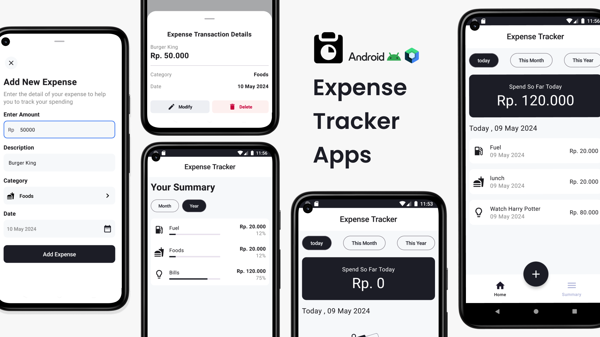

# 💰 Spendly — Android Expense Tracker

<p align="center">
  
</p>

<p align="center">
  <b>A modern Android expense tracking application built with Kotlin.</b>
  <br/>
  Track expenses, organize spending and manage your personal finances easily.
</p>

<p align="center">

  

  

  

  

  

</p>

<p align="center">

  <a href="https://github.com/mahajanritu/Spendly-Android">
    
  </a>

  <a href="https://github.com/mahajanritu/Spendly-Android/fork">
    
  </a>

</p>

---

## 📖 About

**Spendly** is an Android-based personal expense tracker designed to make daily expense management simple, organized and convenient.

The application allows users to record expenses, organize transactions into categories and get a clear overview of their spending.

The project is developed using **Kotlin** and **Android Studio**, with a focus on clean UI, usability and practical Android development.

---

## ✨ Features

### 💰 Expense Management

- Add daily expenses
- Manage expense records
- Track spending information
- Organize expenses by category

### 📊 Expense Overview

- View overall spending
- Monitor expense information
- Understand spending patterns

### 🎨 User Interface

- Clean and modern Android UI
- Simple navigation
- User-friendly expense entry
- Responsive layouts

### ⚡ Performance

- Lightweight Android application
- Fast and simple user experience
- Structured Android project architecture

---

# 📱 Screenshots

<p align="center">
  
  &nbsp;&nbsp;&nbsp;
  
  &nbsp;&nbsp;&nbsp;
  
</p>

<p align="center">
  <b>Home</b>
  &nbsp;&nbsp;&nbsp;&nbsp;&nbsp;
  <b>Add Expense</b>
  &nbsp;&nbsp;&nbsp;&nbsp;&nbsp;
  <b>Expenses</b>
</p>

> 📌 Replace the screenshot paths above with your actual screenshot filenames.

### Suggested Screenshot Structure

```text
screenshots/
├── home.png
├── add-expense.png
├── expenses.png
├── categories.png
└── settings.png
